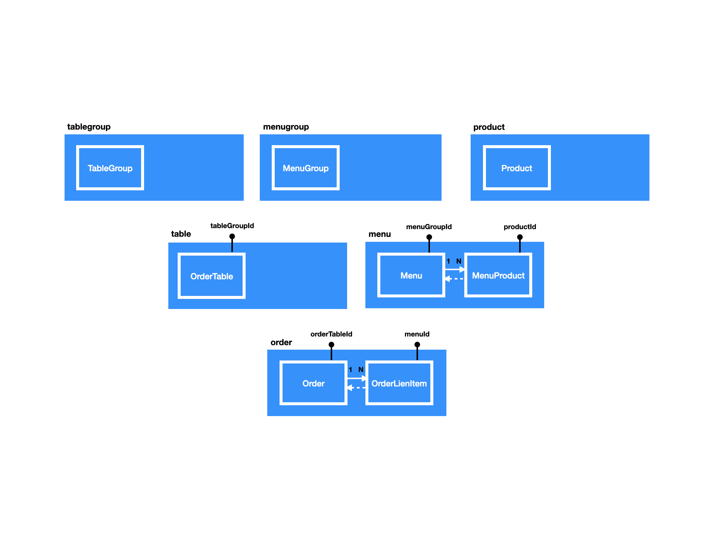

# 1단계 - 테스트를 통한 코드 보호

- [x] `kitchenpos` 패키지의 코드를 보고 키친포스의 요구 사항을 README.md에 작성한다.

- [x] 정리한 키친포스의 요구 사항을 토대로 테스트 코드를 작성한다.

    * 메뉴 그룹

        - [x] 메뉴 그룹 서비스 테스트

        - [x] 메뉴 그룹 인수 테스트

    * 메뉴

        - [x] 메뉴 서비스 테스트

        - [x] 메뉴 인수 테스트

    * 주문

        - [x] 주문 서비스 테스트

        - [x] 주문 인수 테스트

    * 상품

        - [x] 상품 서비스 테스트

        - [x] 상품 인수 테스트

    * 테이블 그룹

        - [x] 테이블 그룹 서비스 테스트

        - [x] 테이블 그룹 인수 테스트

    * 주문 테이블

        - [x] 주문 테이블 서비스 테스트

        - [x] 주문 테이블 인수 테스트

# 2단계 - 서비스 리팩터링

* 단위 테스트하기 어려운 코드와 단위 테스트 가능한 코드를 분리해 단위 테스트 가능한 코드에 대해 단위 테스트를 구현한다.

    * Spring Data JPA 사용 시 `spring.jpa.hibernate.ddl-auto=validate` 옵션을 필수로 준다.

    * 데이터베이스 스키마 변경 및 마이그레이션이 필요하다면 아래 문서를 적극 활용한다.

        * [DB도 형상관리를 해보자!](https://meetup.toast.com/posts/173)

* 프로그래밍 요구 사항

    * Lombok은 그 강력한 기능만큼 사용상 주의를 요한다.

        * 무분별한 setter 메서드 사용

        * 객체 간에 상호 참조하는 경우 무한 루프에 빠질 가능성

        * [Lombok 사용상 주의점(Pitfall)](https://kwonnam.pe.kr/wiki/java/lombok/pitfall)

    * 이번 과정에서는 Lombok 없이 미션을 진행해 본다.
    
    * 자바 코드 컨벤션을 지키면서 프로그래밍한다.

        * 기본적으로 [Google Java Style Guide](https://google.github.io/styleguide/javaguide.html) 을 원칙으로 한다.

        * 단, 들여쓰기는 '2 spaces'가 아닌 '4 spaces'로 한다.

    * indent(인덴트, 들여쓰기) depth를 2를 넘지 않도록 구현한다. 1까지만 허용한다.

        * 예를 들어 while문 안에 if문이 있으면 들여쓰기는 2이다.

        * 힌트: indent(인덴트, 들여쓰기) depth를 줄이는 좋은 방법은 함수(또는 메서드)를 분리하면 된다.

    * 3항 연산자를 쓰지 않는다.

    * else 예약어를 쓰지 않는다.

        * else 예약어를 쓰지 말라고 하니 switch/case로 구현하는 경우가 있는데 switch/case도 허용하지 않는다.

        * 힌트: if문에서 값을 반환하는 방식으로 구현하면 else 예약어를 사용하지 않아도 된다.

    * 모든 기능을 TDD로 구현해 단위 테스트가 존재해야 한다. 단, UI(System.out, System.in) 로직은 제외

        * 핵심 로직을 구현하는 코드와 UI를 담당하는 로직을 구분한다.

        * UI 로직을 InputView, ResultView와 같은 클래스를 추가해 분리한다.

    * 함수(또는 메서드)의 길이가 10라인을 넘어가지 않도록 구현한다.

        * 함수(또는 메소드)가 한 가지 일만 하도록 최대한 작게 만들어라.

    * 배열 대신 컬렉션을 사용한다.

    * 모든 원시 값과 문자열을 포장한다

    * 줄여 쓰지 않는다(축약 금지).

    * 일급 컬렉션을 쓴다.

    * 모든 엔티티를 작게 유지한다.

    * 3개 이상의 인스턴스 변수를 가진 클래스를 쓰지 않는다.

# 3단계 - 의존성 리팩터링

* 요구 사항

    * 이전 단계에서 객체 지향 설계를 의식하였다면 아래의 문제가 존재한다. 의존성 관점에서 설계를 검토해 본다.
    
        * 메뉴의 이름과 가격이 변경되면 주문 항목도 함께 변경된다. 메뉴 정보가 변경되더라도 주문 항목이 변경되지 않게 구현한다.
    
        * 클래스 간의 방향도 중요하고 패키지 간의 방향도 중요하다. 클래스 사이, 패키지 사이의 의존 관계는 단방향이 되도록 해야 한다.
    
        * 데이터베이스 스키마 변경 및 마이그레이션이 필요하다면 아래 문서를 적극 활용한다.
    
            * [DB도 형상관리를 해보자!](https://meetup.toast.com/posts/173)

* 프로그래밍 요구 사항

    * Lombok은 그 강력한 기능만큼 사용상 주의를 요한다.
    
        * 무분별한 setter 메서드 사용

        * 객체 간에 상호 참조하는 경우 무한 루프에 빠질 가능성
    
        * [Lombok 사용상 주의점(Pitfall)](https://kwonnam.pe.kr/wiki/java/lombok/pitfall)

    * 이번 과정에서는 Lombok 없이 미션을 진행해 본다.

* 의존성 리팩터링 결과

    

---

# 키친포스

## 요구 사항

* 메뉴 그룹

    * 메뉴 그룹을 생성한다.

    * 메뉴 그룹 목록을 조회한다.

* 메뉴

    * 메뉴를 생성한다.

        * 메뉴 가격은 `0`이상이어야 한다.

        * 메뉴는 메뉴 그룹에 속해야 한다.

        * 메뉴의 상품이 존재해야 한다.

        * 메뉴 가격은 각 메뉴 상품들 가격에 상품 수량을 곱해서 더한 금액을 초과할 수 없다. 

    * 메뉴 목록을 조회한다.

* 주문

    * 주문을 생성한다.

        * 주문 항목이 존재해야 한다.

        * 주문 항목 수와 메뉴 수가 일치해야 한다.

        * 주문 테이블이 존재해야 한다.

        * 주문 테이블이 비어있지 않아야 한다.

        * 주문에 주문 테이블을 지정한다.

        * 주문 상태를 `COOKING`으로 입데이트한다.

        * 주문 시간을 현재 시간으로 업데이트한다.        
 
    * 주문 목록을 조회한다.

    * 주문 상태를 수정한다.

        * 주문이 있어야 한다.

        * 주문 상태가 `COMPLETION`이 아니어야 한다.

* 상품

    * 상품을 생성한다.

        * 상품 가격은 `0`보다 커야 한다.
 
    * 상품 목록을 조회한다.

* 테이블 그룹

    * 테이블 그룹을 생성한다.

        * 테이블 그룹이 될 주문 테이블 수는 `2` 이상이어야 한다.

        * 테이블 그룹이 될 주문 테이블이 모두 존재해야 한다.

        * 주문 테이블에 다른 테이블 그룹이 없어야 한다.

        * 주문 테이블이 비어있어야 한다.

    * 테이블 그룹을 해제한다.

        * 테이블 그룹에 속해있는 주문 테이블이 `COOKING`이거나 `MEAL`이면 해제할 수 없다.

        * 주문 테이블의 테이블 그룹을 해제한다.

* 주문 테이블
 
    * 주문 테이블을 생성한다.

        * 주문 테이블 생성시 테이블 그룹은 설정하지 않는다. 
 
    * 주문 테이블 목록을 조회한다.
 
    * 기존 주문 테이블을 수정한다.

        * 기존 주문 테이블은 테이블 그룹이 없어야 한다.

        * 기존 주문 테이블 상태가 `COOKING` 또는 `MEAL`이 아니어야 한다.
 
    * 주문 테이블 손님 수를 수정한다.

        * 주문 테이블 손님 수는 `0`이상이어야 한다.

        * 주문 테이블이 존재해야 한다.

        * 주문 테이블이 비어있지 않아야 한다.

## 용어 사전

| 한글명 | 영문명 | 설명 |
| --- | --- | --- |
| 상품 | product | 메뉴를 관리하는 기준이 되는 데이터 |
| 메뉴 그룹 | menu group | 메뉴 묶음, 분류 |
| 메뉴 | menu | 메뉴 그룹에 속하는 실제 주문 가능 단위 |
| 메뉴 상품 | menu product | 메뉴에 속하는 수량이 있는 상품 |
| 금액 | amount | 가격 * 수량 |
| 주문 테이블 | order table | 매장에서 주문이 발생하는 영역 |
| 빈 테이블 | empty table | 주문을 등록할 수 없는 주문 테이블 |
| 주문 | order | 매장에서 발생하는 주문 |
| 주문 상태 | order status | 주문은 조리 ➜ 식사 ➜ 계산 완료 순서로 진행된다. |
| 방문한 손님 수 | number of guests | 필수 사항은 아니며 주문은 0명으로 등록할 수 있다. |
| 단체 지정 | table group | 통합 계산을 위해 개별 주문 테이블을 그룹화하는 기능 |
| 주문 항목 | order line item | 주문에 속하는 수량이 있는 메뉴 |
| 매장 식사 | eat in | 포장하지 않고 매장에서 식사하는 것 |
